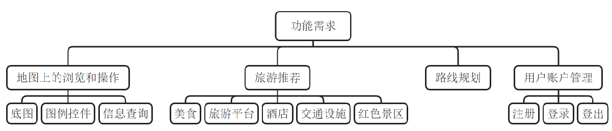
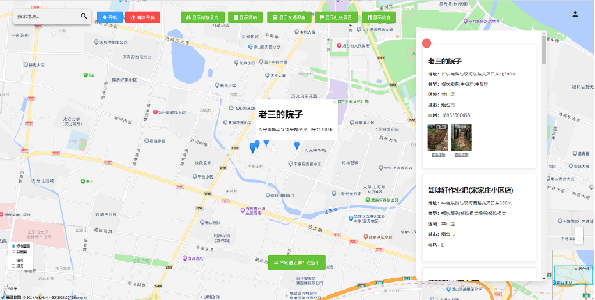
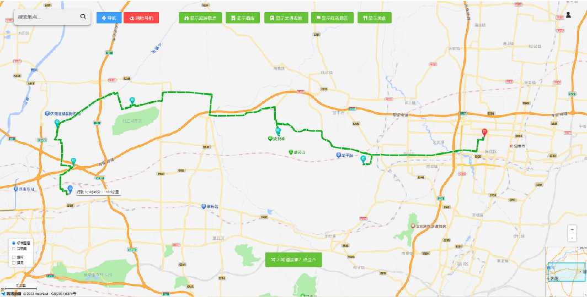
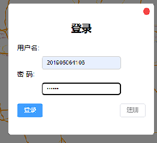
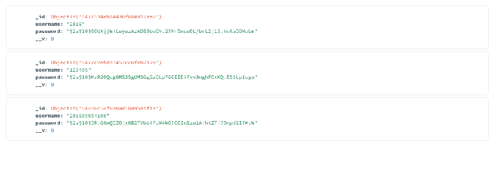

# my-final
## 简介
WebGIS平台可以将复杂数字信息转化为直观的可视化地图，帮助用户更容易地理解和分析各种数据。利用WebGIS平台可以清晰地展示山东省各旅游景区的分布、交通网络状况等，便于规划者和游客获取所需信息。
基于WebGIS的山东省旅游规划平台能够提供可视化展示、支持空间分析、提供开放性与互动性。这有助于提高山东省旅游规划的效率和质量，促进旅游业的持续发展，为游客提供更优质的旅游服务。





## Project setup
```
npm install
```

### Compiles and hot-reloads for development
```
npm run serve
```

### Compiles and minifies for production
```
npm run build
```

### Lints and fixes files
```
npm run lint
```

### Customize configuration
See [Configuration Reference](https://cli.vuejs.org/config/).

## 总结
该平台的建立使山东省旅游规划工作实现了信息化，提高了规划的效率和精度。这个平台利用WebGIS技术，收集和整理了大量的山东省旅游资源的地理信息，包括各个旅游景点的位置、类型、特色等信息，为用户提供了一个直观的信息查询和参考工具。
平台未能提供多种智能推荐和个性化旅游线路规划功能，仍有改进空间。未来可以研究更多先进的推荐算法和人工智能技术，以提高推荐的准确性和个性化程度。


